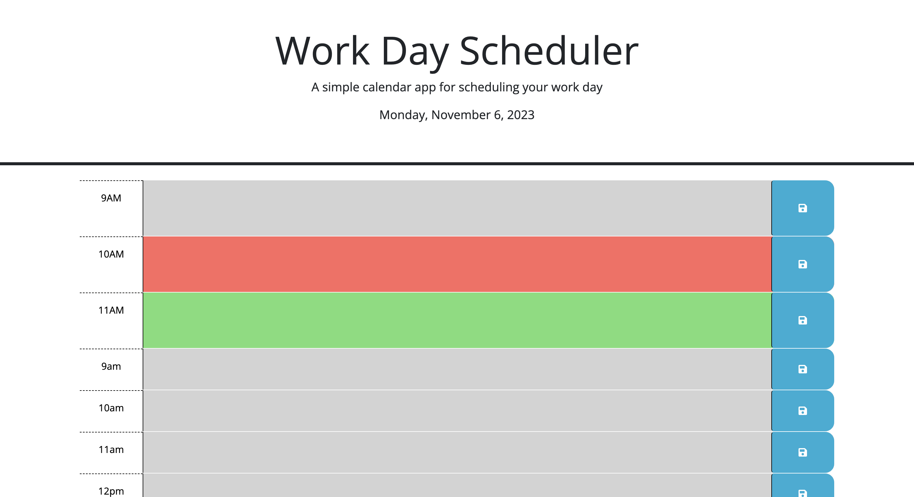

# Module5Challenge

This is my Module 5 challenge for week 5.

## Work Day Scheduler

The Work Day Scheduler is a simple calendar application that allows you to save events for each hour of a typical working day from 9 AM to 5 PM. You can easily manage your daily schedule using this application.

## Table of Contents

- [Installation](#installation)
- [Usage](#usage)
- [Features](#features)
- [Screenshots](#screenshots)
- [Contributing](#contributing)
- [License](#license)

## Installation

1. Clone the repository to your local machine:

2. Open the index.html file in your web browser to use the Work Day Scheduler.

## Usage

- When you open the scheduler, you will see time blocks for standard business hours (9 AM - 5 PM).
- Each time block is color-coded to indicate whether it's in the past, present, or future.
- Click into a time block to enter an event.
- Click the "Save" button to save the event, and a success message will be displayed.

## Features

- Current day is displayed at the top of the calendar.
- Color-coded time blocks indicate past, present, or future hours.
- Events are saved in local storage and persist even after page refresh.

## Deployed Application

You can access the deployed Work Day Scheduler application [here](https://your-deployed-app-url.com).

## Screenshots

